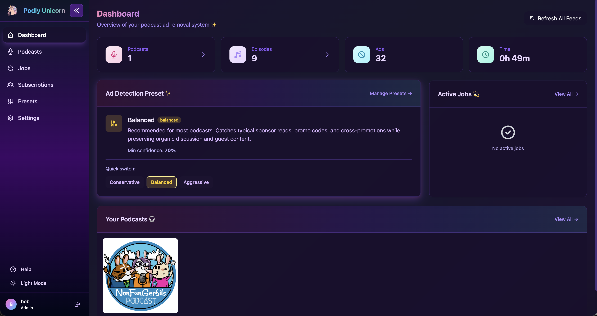
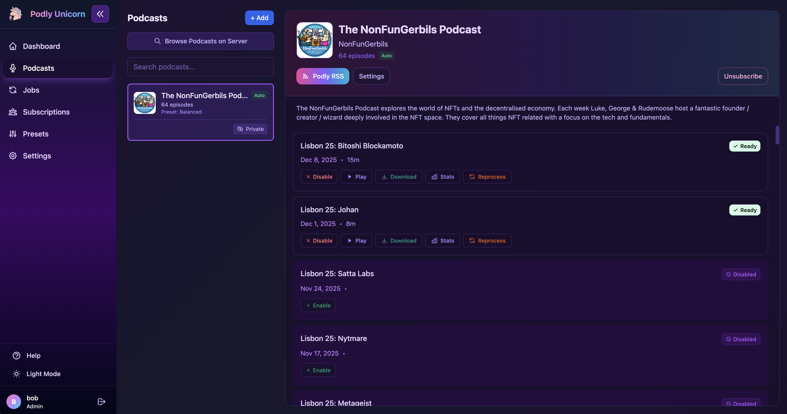
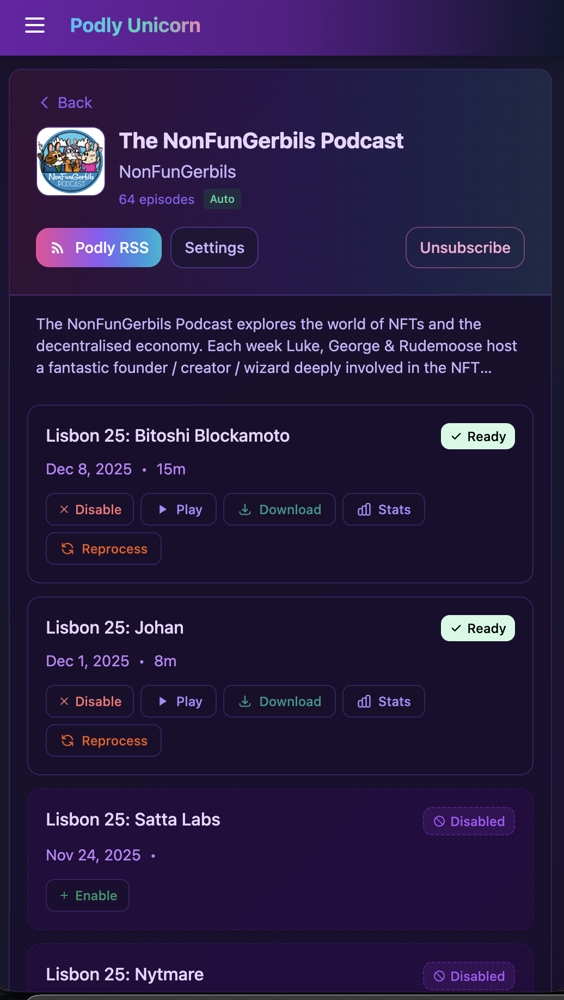

<div align="center">
  
  <h1>Podly Unicorn</h1>
  
  <p>
    <a href="https://github.com/lukefind/podly-unicorn"></a>
    <a href="https://github.com/jdrbc/podly_pure_podcasts/blob/main/LICENCE"></a>
  </p>
</div>

---

## What is Podly Unicorn?

Podly Unicorn automatically removes advertisements from podcasts using AI. Add your favorite shows, and Podly creates ad-free RSS feeds you can subscribe to in any podcast app.

This is a fork of [Podly Pure Podcasts](https://github.com/jdrbc/podly_pure_podcasts) with significant UI/UX improvements and new features.

<div align="center">
  
  <p><em>Dashboard showing podcast statistics and ad removal progress</em></p>
</div>

<div align="center">
  
  <p><em>Podcasts page with episode management</em></p>
</div>

<div align="center">
  <table>
    <tr>
      <td></td>
      <td></td>
    </tr>
    <tr>
      <td align="center"><em>Mobile podcasts view</em></td>
      <td align="center"><em>Processed episode details</em></td>
    </tr>
  </table>
</div>

---

## Updates from Original App

### 🎨 Completely Redesigned UI
- Pastel unicorn theme with purple/pink gradients (light & dark mode)
- Episode-specific thumbnails in RSS feeds (when available from source)

### 🆕 First-Time User Onboarding
- Interactive tutorial on first login
- Step-by-step guide: find podcasts, enable episodes, subscribe in your app
- Explains auto-enable, auto-process, and on-demand processing
- "Replay Tutorial" option in Help modal

### 👥 Multi-User Authentication System
- Per-user feed subscriptions - each user sees only their podcasts
- Private subscriptions - hide your podcasts from other users
- Browse Podcasts on Server - discover feeds other users have added (unless made private)
- User-specific dashboard stats - see your own episodes processed and ad time saved
- Request access / signup flow with admin approval

### 📻 All-in-One Combined Feed
- Single RSS feed with all your subscribed podcasts combined
- Add one feed URL to your podcast app, get all your ad-free shows
- Feed uses Podly Unicorn logo, episodes keep their original artwork
- Click "All-in-One Podly RSS" button on Podcasts page to copy the URL

### 🎛️ Prompt Presets System
- 3 built-in presets: Conservative, Balanced, Aggressive
- Custom presets - create your own ad detection prompts
- Per-show preset overrides - different presets for different podcasts
- Preset tracking - see which preset was used for each episode

### 📊 Enhanced Statistics & Monitoring
- Per-user statistics (admin) - episodes processed, downloads, ad time removed
- Processing progress indicators on episode cards

### ⚙️ Admin Controls
- Feed visibility controls - hide sensitive feeds from browse page
- Disable auto-process for all users on a feed
- Feed status badges - Public, Private, Hidden, Auto indicators
- User management - view all subscriptions and usage
- Database maintenance tools - repair processed paths after migrations
- Signup controls - enable/disable user registration

### 🔄 Auto-Process New Episodes
- Per-feed toggle to automatically process new episodes
- Shared across users - if anyone enables it, new episodes auto-process
- Visual indicators showing which feeds have auto-process enabled

### 📱 Mobile Optimizations
- Fully responsive design for phones and tablets
- Touch-friendly controls and modals
- Optimized layouts for small screens

---

## How It Works

1. **Add a podcast** — Paste an RSS feed URL or search the built-in podcast catalog
2. **Transcribe** — Podly uses Whisper (via Groq or local) to transcribe each episode
3. **Detect ads** — An LLM analyzes the transcript to identify ad segments with timestamps
4. **Remove ads** — FFmpeg silently cuts the detected segments from the audio
5. **Subscribe** — Get a new RSS feed URL to use in your favorite podcast app

Processing happens on-demand when you click "Process" or when your podcast app requests an episode.

---

## Quick Start (Docker)

### Prerequisites
- Docker and Docker Compose
- LLM API key from [Groq](https://console.groq.com/keys) (free) or OpenAI/xAI

### 1. Clone and Configure

```bash
git clone https://github.com/lukefind/podly-unicorn.git
cd podly-unicorn
cp .env.local.example .env.local
```

Edit `.env.local`:

```bash
# Required: LLM for ad detection
LLM_API_KEY=gsk_your_groq_key
LLM_MODEL=groq/llama-3.3-70b-versatile

# Required: Whisper for transcription
WHISPER_TYPE=groq
GROQ_API_KEY=gsk_your_groq_key

# Recommended: Enable authentication
REQUIRE_AUTH=true
PODLY_ADMIN_USERNAME=admin
PODLY_ADMIN_PASSWORD=your-secure-password
```

### 2. Start

```bash
docker compose up -d --build
```

### 3. Access

Open http://localhost:5001

---

## Configuration

### LLM Providers

| Provider | Model | Notes |
|----------|-------|-------|
| **Groq** | `groq/llama-3.3-70b-versatile` | Free tier, fast |
| **xAI Grok** | `xai/grok-3` | Recommended for accuracy (~$0.10/episode) |
| **OpenAI** | `gpt-4o` | High quality |

For xAI Grok:
```bash
LLM_API_KEY=xai-your-key
LLM_MODEL=xai/grok-3
OPENAI_BASE_URL=https://api.x.ai/v1
```

### Whisper (Transcription)

| Mode | Config | Notes |
|------|--------|-------|
| **Groq** | `WHISPER_TYPE=groq` | Fast, cheap, recommended |
| **Local** | `WHISPER_TYPE=local` | Free, requires RAM |

---

## Updating

```bash
cd podly-unicorn
git pull
docker compose up -d --build
```

---

## Common Commands

```bash
# View logs
docker logs -f podly-pure-podcasts

# Restart
docker compose restart

# Stop
docker compose down

# Backup database
docker cp podly-pure-podcasts:/app/src/instance/sqlite3.db ./backup.db
```

---

## Development

```bash
# Frontend (hot reload)
cd frontend && npm install && npm run dev

# Backend
docker compose up --build
```

---

## Credits

Fork of [Podly Pure Podcasts](https://github.com/jdrbc/podly_pure_podcasts) by [@jdrbc](https://github.com/jdrbc).

---

<div align="center">
  <p>
    <a href="https://github.com/lukefind/podly-unicorn">GitHub</a> •
    <a href="https://github.com/lukefind/podly-unicorn/issues">Issues</a>
  </p>
</div>
