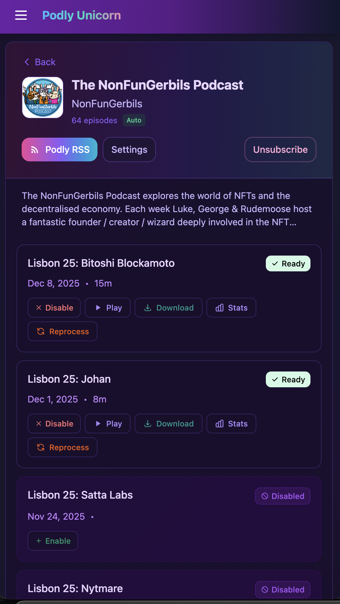

<div align="center">
  
  <h1>Podly Unicorn</h1>
  
  <p>
    <a href="https://github.com/lukefind/podly-unicorn"></a>
    <a href="https://github.com/jdrbc/podly_pure_podcasts/blob/main/LICENCE"></a>
    <a href="https://t.me/+AV5-w_GSd2VjNjBk"></a>
  </p>
</div>

---

## What is Podly Unicorn?

Podly Unicorn is a self-hosted podcast ad-removal server with a web app. It transcribes episodes, uses LLMs to detect ad segments, and publishes cleaned RSS feeds you can use in your normal podcast player.

You manage feeds, presets, processing, and users in the browser. Listening still happens in your podcast app, through direct downloads, or in Podly Unicorn's built-in audio player.

This is a fork of [Podly Pure Podcasts](https://github.com/jdrbc/podly_pure_podcasts) with significant UI/UX improvements and new features.

<div align="center">
  
  <p><em>Dashboard showing podcast statistics and ad removal progress</em></p>
</div>

<div align="center">
  <table>
    <tr>
      <td></td>
      <td></td>
    </tr>
    <tr>
      <td align="center"><em>Mobile podcasts view</em></td>
      <td align="center"><em>Processed episode details</em></td>
    </tr>
  </table>
</div>

---

## Highlights

### Podcast-App Workflow
- Add shows by search, by browsing feeds already on the server, or by pasting an RSS URL
- Copy either a per-show Podly RSS feed or one combined all-in-one feed
- Start processing from the web UI or from the `Process this episode (remove ads)` link inside episode notes
- Listen through your podcast app, download audio directly, or use the built-in player

### Processing Controls
- On-demand processing by default so RSS polling does not accidentally start jobs
- Optional auto-process for new episodes on a per-feed basis
- Reprocess episodes after changing prompts or settings
- Recent episodes auto-enable when you add a show, and new releases auto-enable as they arrive

### Ad Detection and AI Configuration
- Built-in Conservative, Balanced, and Aggressive presets
- Custom presets and per-show default preset overrides
- Saved encrypted API key profiles in the Settings UI
- Groq, xAI, OpenAI, Anthropic, Google Gemini, and custom OpenAI-compatible providers
- Local, remote, or Groq-based Whisper transcription

### Multi-User and Admin Features
- Session auth for the web app with tokenized RSS/feed links for podcast apps
- Public and private feed subscriptions plus server-wide podcast discovery
- Optional signup requests with admin approval and password reset flows
- Feed visibility controls, user statistics, subscription management, and repair tools

### UI and Mobile
- Responsive desktop and mobile web app
- Blue, Light, and Dark themes
- Installable PWA over HTTPS
- First-run onboarding plus an in-app help modal

---

## How It Works

1. **Add a podcast** — Search, browse, or paste an RSS feed URL
2. **Enable episodes** — Podly auto-enables recent episodes, and you can enable/disable anything else
3. **Choose your feed** — Copy either a per-show Podly RSS link or the combined all-in-one feed
4. **Start processing** — Use the web UI or tap the trigger link in your podcast app
5. **Listen ad-free** — Refresh your feed and play the processed version, or download/play it from the web app

### On-Demand Processing

Podly does **not** process every episode automatically by default. That keeps resource usage predictable and avoids accidental mass processing from RSS polling or podcast-app prefetching.

You can start processing in three ways:
1. **Web UI** — Click **Process** on an enabled episode
2. **Podcast app** — Tap `Process this episode (remove ads)` in the episode description
3. **Auto-process** — Enable it in show settings to process new episodes after feed refresh

When you trigger an episode from your podcast app:
1. A progress page opens in the browser
2. When it says **Episode Ready**, close the tab
3. Refresh the feed in your podcast app and play the processed episode

### Authentication Modes and RSS Behavior

`REQUIRE_AUTH=true` is recommended for podcast app use.

- `REQUIRE_AUTH=true`: Podly generates tokenized RSS/feed links (`feed_token` + `feed_secret`) so podcast apps can use feed, trigger, and download flows directly.
- `REQUIRE_AUTH=false`: Feed URLs are public, but podcast-app trigger/download links are more limited in the current release because those endpoints still rely on token or session auth.

If logs show `reason=not_whitelisted`, that episode is disabled for processing. Enable it in the Podcasts page first.

---

## Quick Start (Docker)

### Prerequisites
- Docker
- OpenSSL (for generating the stable application secret)

No repository clone or local image build is required.

### 1. Create the deployment settings

```bash
mkdir -p podly-unicorn
cd podly-unicorn
umask 077
podly_secret=$(openssl rand -hex 32)
cat > podly.env <<EOF
REQUIRE_AUTH=true
PODLY_ADMIN_USERNAME=admin
PODLY_ADMIN_PASSWORD=replace-with-at-least-8-characters
PODLY_SECRET_KEY=${podly_secret}
SESSION_COOKIE_SECURE=false
EOF
chmod 600 podly.env
unset podly_secret
```

The `umask 077` and `chmod 600` steps keep `podly.env` owner-only, including when rerunning these commands over an existing file. Keep the file private and backed up. `PODLY_SECRET_KEY` must remain unchanged across container upgrades or encrypted saved keys, sessions, and derived feed secrets will stop working. The admin password must be at least eight characters.

`SESSION_COOKIE_SECURE=false` is only for this documented localhost HTTP setup. For an Internet-accessible deployment, terminate HTTPS with a reverse proxy and set `SESSION_COOKIE_SECURE=true`.

### 2. Create persistent storage and run the public image

```bash
docker volume create podly-data
docker pull ghcr.io/lukefind/podly-unicorn:latest
docker run -d \
  --name podly-unicorn \
  --restart unless-stopped \
  --env-file podly.env \
  -p 127.0.0.1:5001:5001 \
  -v podly-data:/app/src/instance \
  ghcr.io/lukefind/podly-unicorn:latest
```

Open http://localhost:5001, sign in, then use **Settings → Quick Setup** to add a Groq key or **Settings → LLM Configuration** to select another provider. API keys and provider settings are configured in the web UI; they are not baked into the image.

### Pull-based Compose alternative

Compose users can download only the runtime definition—still without cloning or building the repository:

```bash
mkdir -p podly-unicorn/src/instance
cd podly-unicorn
curl -fsSLo compose.yml https://raw.githubusercontent.com/lukefind/podly-unicorn/main/compose.yml

# Create podly.env with the same five settings shown above, then start:
PODLY_ENV_FILE=./podly.env docker compose pull
PODLY_ENV_FILE=./podly.env docker compose up -d
```

This Compose path keeps application data in `./src/instance`. Do not delete that directory during upgrades.

---

## Install as a Mobile App (PWA)

Podly can be installed as a Progressive Web App on your phone or tablet for a native app-like experience — no app store required.

### Android (Chrome)
1. Open your Podly server URL in Chrome
2. Tap the **three-dot menu** (⋮) → **"Add to Home screen"** or **"Install app"**
3. Confirm the installation
4. Podly appears on your home screen as a standalone app

### iOS (Safari)
1. Open your Podly server URL in Safari
2. Tap the **Share button** (📤) → **"Add to Home Screen"**
3. Tap **"Add"**
4. Podly appears on your home screen as a standalone app

> **Note:** Your Podly server must be served over HTTPS for PWA installation to work. If running locally without HTTPS, PWA install will not be available.

---

## Configuration

### LLM Providers

You can configure LLM providers in **Settings** after startup, or through environment variables in `.env.local`. The fastest path is **Settings → Quick Setup** with a Groq key. For advanced setups, use **Settings → LLM Configuration** to save encrypted key profiles or point Podly at env-backed keys.

| Provider | Example Models | Notes |
|----------|----------------|-------|
| **Groq** | `groq/openai/gpt-oss-120b`, `groq/llama-3.3-70b-versatile` | Fast, good default, free tier available |
| **xAI (Grok)** | `xai/grok-3`, `xai/grok-3-mini` | Strong ad detection quality |
| **OpenAI** | `gpt-4o-mini`, `gpt-4o`, `gpt-4.1` | Standard OpenAI-compatible path |
| **Anthropic** | `anthropic/claude-3-7-sonnet-latest` | High quality alternative |
| **Google Gemini** | `gemini/gemini-2.0-flash` | Fast and cost-effective |
| **Custom / Other** | OpenAI-compatible models | Use a custom base URL and API key |

Models with a provider prefix (e.g. `groq/`, `xai/`, `anthropic/`) are routed automatically — no Base URL needed.

For xAI Grok via env vars:
```bash
LLM_API_KEY=xai-your-key
LLM_MODEL=xai/grok-3
# OPENAI_BASE_URL is optional — xai/ prefix auto-routes
```

> **Tip:** You can save encrypted API keys or select env-backed key references in **Settings → LLM Configuration** without editing the runtime config by hand.

### Whisper (Transcription)

| Mode | Config | Notes |
|------|--------|-------|
| **Groq** | `WHISPER_TYPE=groq` | Fast, recommended default |
| **Local** | `WHISPER_TYPE=local` | Runs on your own machine, no transcription API cost |
| **Remote** | `WHISPER_TYPE=remote` | Use an OpenAI-compatible remote Whisper endpoint |

---

## Updating

For the no-clone `docker run` installation, pull the candidate first, then recreate only the named container. The `podly-data` volume is retained:

```bash
docker pull ghcr.io/lukefind/podly-unicorn:latest
docker stop podly-unicorn
docker rm podly-unicorn
docker run -d \
  --name podly-unicorn \
  --restart unless-stopped \
  --env-file podly.env \
  -p 127.0.0.1:5001:5001 \
  -v podly-data:/app/src/instance \
  ghcr.io/lukefind/podly-unicorn:latest
```

For the pull-based Compose installation:

```bash
PODLY_ENV_FILE=./podly.env docker compose pull
PODLY_ENV_FILE=./podly.env docker compose up -d
```

Database migrations run automatically on startup — no manual steps needed.

---

## Upgrading from Podly Pure Podcasts / Earlier Versions

If you're migrating from an older version of Podly, your `.env.local` likely has LLM settings that will **override** the new Settings UI.

### Clean up your `.env.local`

**Before (old-style — env vars control everything):**
```bash
GROQ_API_KEY=gsk_...
LLM_API_KEY=xai-...
LLM_MODEL=xai/grok-3
OPENAI_BASE_URL=https://api.x.ai/v1
WHISPER_TYPE=groq
```

**After (recommended — let the UI manage everything):**
```bash
# Auth (keep as-is)
REQUIRE_AUTH=true
PODLY_ADMIN_USERNAME=...
PODLY_ADMIN_PASSWORD=...
PODLY_SECRET_KEY=...
```

All LLM and Whisper settings are now configurable in **Settings** — no env vars needed.

**What changed and why:**

| Env var | Action | Reason |
|---------|--------|--------|
| `GROQ_API_KEY` | **Remove** | Enter your Groq key in **Settings → Quick Setup** instead. It's saved encrypted in the database and configures both Whisper and LLM. |
| `LLM_API_KEY` | **Remove** | Manage your LLM API key in **Settings → LLM Configuration**. You can save encrypted key profiles and switch providers without restarting. |
| `LLM_MODEL` | **Remove** | Select your model in the Settings UI. Env var overrides the UI if present. |
| `OPENAI_BASE_URL` | **Remove** | No longer needed — models with a provider prefix (e.g. `xai/grok-3`, `groq/...`) are routed automatically by LiteLLM. |
| `WHISPER_TYPE` | **Remove** | Select Whisper mode (groq/local/remote) in **Settings → Whisper**. Default is groq. |

> **Note:** If you prefer env vars over the UI, that still works — just be aware that any `GROQ_API_KEY`, `WHISPER_TYPE`, `LLM_MODEL`, `LLM_API_KEY`, or `OPENAI_BASE_URL` set in `.env.local` will override what you configure in Settings, and the UI will show a warning.

### After editing `.env.local`

```bash
docker compose restart
```

Then open **Settings → LLM Configuration** to select your provider, model, and API key source.

---

## Common Commands

For the no-clone `docker run` installation:

```bash
# View logs
docker logs -f podly-unicorn

# Restart
docker restart podly-unicorn

# Stop
docker stop podly-unicorn

# Backup database
docker cp podly-unicorn:/app/src/instance/sqlite3.db ./backup.db
```

Compose users can use `docker compose logs -f`, `docker compose restart`, and `docker compose down` from their deployment directory.

---

## Development

```bash
# Frontend (hot reload)
cd frontend && npm install && npm run dev

# Full local contributor build
PODLY_ENV_FILE=.env.local docker compose -f compose.yml -f compose.build.yml up -d --build
```

---

## Contributing

See [contributing guide](docs/contributors.md) for local setup & contribution instructions.

### Maintainer releases

Container releases are automated from `main`: a verified commit becomes the
immutable `sha-<full-commit>` candidate before its exact digest is promoted to
`latest`. Maintainers should follow the [container release
runbook](docs/RELEASE_RUNBOOK.md) and wait for the **Build and Publish
Container** workflow to succeed before treating `latest` as deployable.

---

<div align="center">
  <p>
    <a href="https://github.com/lukefind/podly-unicorn">GitHub</a> •
    <a href="https://github.com/lukefind/podly-unicorn/issues">Issues</a> •
    <a href="https://t.me/+AV5-w_GSd2VjNjBk">Telegram</a>
  </p>
</div>
